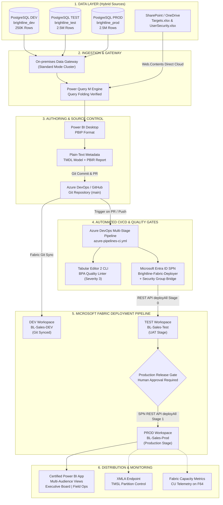

# Brightline Analytics — Enterprise Power BI & Fabric Deployment Pipeline

[](https://dev.azure.com/punitgiri74/Brightline-Analytics)
[-008272?logo=microsoftazure&logoColor=white)](https://app.fabric.microsoft.com)
[](src/)
[](bpa-rules/BPARules.json)
[](docs/learning-tracker.md#capstone-architecture-certification--final-sign-off)

---

## Executive Summary

**Brightline Analytics** is an enterprise-grade, end-to-end Power BI and Microsoft Fabric deployment pipeline reference architecture. Built for **Brightline Distribution Pvt. Ltd.**—a national fast-moving consumer goods (FMCG) distributor operating across 78 retail stores and 4 regions in India—this repository demonstrates the end-to-end lifecycle of mission-critical business intelligence:

From **on-premises PostgreSQL ERP extraction** and **SharePoint cloud quota ingestion**, through **PBIP / TMDL plain-text semantic modeling**, **Azure DevOps Git version control**, **automated headless Tabular Editor Best Practice Analyzer (BPA) CI gates**, to **3-tier Fabric Deployment Pipelines (`DEV -> TEST -> PROD`)** automated via **Service Principal (SPN) OAuth 2.0 REST APIs** and gated by **Production Environment approvals**.

This project establishes how modern data teams eliminate fragile, monolithic `.pbix` desktop publishing in favor of resilient, auditable, and automated CI/CD practices that guarantee zero-downtime releases, preserve historical VertiPaq partition histories, and satisfy strict enterprise security governance.

---

## Business Scenario

**Brightline Distribution Pvt. Ltd.** distributes consumer goods across 4 geographic operational territories (North, South, West, East) in India:
- **Commercial Scope:** ₹2.04 Billion annual revenue across 2.5 Million sales transactions.
- **Enterprise Dimensions:** 78 retail distribution stores, 44 product SKUs (5 merchandise categories: Beverages, Personal Care, Packaged Foods, Home Care, Snacks), 210 wholesale customer accounts, and 17 dedicated regional sales representatives.
- **Operational Challenge:** 
  - Business stakeholders required unified visibility across transaction revenue, margins, and sales rep performance against corporate quotas.
  - Financial leadership mandated strict **Object-Level Security (OLS)** hiding unit cost and margin metadata from field store managers.
  - Regional directors required **Dynamic Row-Level Security (RLS)** filtering data strictly to their authorized territories.
  - Executive leadership required a certified, decoupled **Power BI App** delivering instant KPI dashboards without downtime or developmental exposure during release cycles.

---

## What This Project Demonstrates

The architecture encompasses the full Microsoft Fabric and Power BI enterprise maturity model, organized across core engineering domains:

### 1. Data Architecture & Hybrid Ingestion
- **Relational ERP on PostgreSQL 16:** Normalized `erp` schema (`products`, `stores`, `customers`, `sales_reps`, `sales_transactions`) hosted on-premises.
- **Mixed-Source Connectivity:** Blends on-premises relational databases with cloud spreadsheets (`Targets.xlsx` monthly quotas and `UserSecurity.xlsx` role mappings) hosted on SharePoint / OneDrive for Business.
- **Power Query Query Folding:** Verified native SQL query translation (`Value.NativeQuery`) pushing range filtering (`txn_date`) down to PostgreSQL to ensure high-performance incremental ingestion.
- **Formula.Firewall Isolation:** Unified Privacy Levels across on-prem and cloud endpoints to prevent cross-source credential evaluation failures during scheduled cloud refreshes.

### 2. Semantic Modeling & Modern Developer Lifecycle (PBIP / TMDL)
- **Star Schema Design:** 1 central fact table (`Fact_Sales`) surrounded by 5 conform dimensions (`Dim_Products`, `Dim_Stores`, `Dim_Customers`, `Dim_SalesReps`, `Dim_Date`) with 1-to-many single-direction relationships.
- **Plain-Text TMDL Serialization:** Fully converted from legacy binary `.pbix` to Power BI Project (`.pbip`) format, serializing model metadata into Tabular Model Definition Language (`.tmdl`) files.
- **Decoupled Thin Reports:** Thin report (`Brightline_Sales_Report.Report`) connected via Live Connection to the independent semantic model (`Brightline_Sales.SemanticModel`), enabling parallel, non-blocking development across modeling and visual engineering teams.

### 3. Enterprise Security Governance
- **Dynamic Row-Level Security (RLS):** Implemented role `Regional_Sales_Access` filtering data dynamically based on `USERPRINCIPALNAME()`. Authenticated user emails evaluate against the `UserSecurity` bridge table, automatically filtering `Dim_Stores` and propagating downward across relationships.
- **Object-Level Security (OLS):** Hardened financial confidentiality using Tabular Editor by restricting access to `Dim_Products[unit_cost]` and `Fact_Sales[total_cogs]` for unauthorized personas.
- **Separation of Concerns:** Workspace roles (Admin/Member/Contributor/Viewer) strictly segregated from downstream App consumer permissions, preventing accidental RLS bypass.

### 4. Big Data Partitioning & Scale (Fabric F64 / XMLA)
- **Incremental Refresh Policies:** Configured `RangeStart` / `RangeEnd` parameters archiving 36 months of historical transactions while incrementally refreshing only the recent 3 months.
- **VertiPaq Partition Freezing:** Verified that historical partitions remain frozen and compressed in memory, reducing refresh duration from minutes to 1m 23s and eliminating redundant compute costs.
- **XMLA / TMSL Protocol Management:** Model accessible via the Fabric XMLA read/write endpoint (`powerbi://api.powerbi.com/v1.0/myorg/BL-Sales-Prod`), enabling direct partition inspection, hotfix scripting, and TMSL deployment reconciliation.

### 5. Multi-Stage Deployment Pipelines & Governance
- **3-Tier Workspace Topology:** Formal staging across `BL-Sales-DEV` (Development), `BL-Sales-Test` (UAT / QA), and `BL-Sales-Prod` (Production).
- **Automated Deployment Rules:** Parameter rules automatically swap `PG_Database` from `brightline_dev` (250K rows / 6 months) to `brightline_test` and `brightline_prod` (2.5M rows / 36 months) without modifying model code.
- **Gateway Connection Rules:** Automatically remap dataset data sources from development gateways (`BL-PG-DEV`) to isolated testing (`BL-PG-TEST`) and production (`BL-PG-PROD`) connections.
- **Compare Drift Engine:** Validates schema synchronization and detects out-of-band drift before downstream promotion.

### 6. Azure DevOps CI/CD Automation & Shift-Left Quality Gates
- **Headless Linter Execution:** Azure DevOps pipeline automatically downloads Tabular Editor 2 CLI v2.28.0 in Windows runners and executes automated scans against `bpa-rules/BPARules.json`.
- **Branch Protection Policies:** Enforces strict PR policies on `main`: unformatted DAX measures or unsafe `/` arithmetic operators immediately fail the build with exit code 1, blocking merges until code is compliant.
- **Service Principal (SPN) REST API Promotion:** Authenticates via Microsoft Entra ID OAuth 2.0 client credentials using Service Principal `Brightline-Fabric-Deployer` and triggers deployment pipeline promotions via `POST /deployAll`.
- **Production Approval Gate:** Incorporates an Azure DevOps release environment (`Brightline-Production-Environment`) that halts execution, issues email alerts to designated approvers, and requires human sign-off before promoting into `PROD`.

### 7. Performance Engineering & Telemetry Monitoring
- **DAX Studio Server Timings:** Diagnosed Storage Engine (SE) multithreaded scans vs Formula Engine (FE) iteration. Refactored iterator bottlenecks (Lab L15) to eliminate expensive callbacks (`CallbackDataID = 0`), dropping materialized rows from 376 to 8 and reducing latency to 13 ms.
- **Microsoft Fabric Capacity Metrics App:** Real-time telemetry monitoring on capacity `FTL4` (Central India). Telemetry confirmed healthy operations: average utilization 0.27%, peak utilization 5.91% during UAT refresh, and zero throttled operations.

### 8. Chaos Engineering & Sabotage Labs
- **20 Real-World Production Scenarios:** Hands-on catalog covering gateway unreachable states, credential rotations, schema renames, duplicate `.platform` logicalId collisions, TMDL git merge conflict resolutions, and RLS bypass vulnerabilities.

---

## End-to-End Architecture

The following diagram illustrates the complete data processing, metadata serialization, version control, and multi-stage deployment architecture:



### Architectural Flow Description
1. **Data Ingestion:** PostgreSQL ERP transactions are securely transferred via an On-premises Data Gateway cluster with verified query folding. Quota targets and security matrices are ingested directly via cloud `Web.Contents()` endpoints.
2. **Metadata Serialization:** Models are authored in Power BI Desktop and stored as plain-text TMDL definition files, enabling granular Git tracking and human-readable code reviews.
3. **CI Shift-Left Quality Gate:** On opening a Pull Request, Azure Pipelines downloads Tabular Editor 2 CLI, scans TMDL definitions against `BPARules.json`, and blocks non-compliant commits before merging.
4. **Git Workspace Hydration:** Merging to `main` updates the Git repository; the Fabric `BL-Sales-DEV` workspace synchronizes directly via Fabric Git integration.
5. **Stage 1 Automated Promotion (DEV -> TEST):** The pipeline authenticates via Service Principal `Brightline-Fabric-Deployer` and issues an automated REST API call (`deployAll`, `sourceStageOrder: 0`) to promote DEV artifacts into `BL-Sales-Test`, where deployment rules swap database parameters to `brightline_test` (2.5M rows).
6. **Stage 2 Gated Promotion (TEST -> PROD):** The pipeline halts at `Brightline-Production-Environment` and alerts approvers. Once manually approved, the pipeline executes `deployAll` (`sourceStageOrder: 1`), promoting tested artifacts into `BL-Sales-Prod` and binding them to `brightline_prod`.
7. **Consumption & Scale:** End-users access analytics through the decoupled, multi-audience Power BI App. Capacities and historical VertiPaq partitions are monitored via the Fabric Capacity Metrics App and XMLA endpoints.

---

## Technology Stack

| Domain | Technology / Component | Version / Tier | Architectural Purpose |
| :--- | :--- | :--- | :--- |
| **Relational Database** | PostgreSQL | 16.2 | On-premises transactional ERP database (`erp` schema) |
| **Data Gateway** | On-premises Data Gateway | Standard Mode (HTTPS) | Secure hybrid connectivity between PostgreSQL and Power BI cloud |
| **Cloud Storage** | SharePoint / OneDrive for Business | Microsoft 365 E5 | Storage for organizational quota seeds and dynamic security matrices |
| **BI Authoring** | Power BI Desktop | Latest PBIP Mode | Modern semantic modeling and thin report layout authoring |
| **Metadata Format** | TMDL / PBIR | v1.0 | Human-readable, Git-friendly plain-text tabular model definition |
| **Cloud Analytics** | Microsoft Fabric / Power BI Service | F64 Capacity (FTL4) | Cloud workspace hosting, semantic model execution, and app distribution |
| **Deployment Engine** | Fabric Deployment Pipelines | Premium / Fabric | 3-tier lifecycle management with automated parameter and gateway rules |
| **Source Control** | Azure Repos & GitHub | Git 2.40+ | Multi-branch source control, PR peer review, and branch protection |
| **CI/CD Automation** | Azure Pipelines | Multi-Stage YAML | Automated build validation, headless linting, and REST API stage deployment |
| **Code Quality / Linter** | Tabular Editor 2 Portable CLI | v2.28.0 | Headless command-line Best Practice Analyzer (BPA) rule enforcement |
| **Identity & Security** | Microsoft Entra ID (Azure AD) | Cloud Tenant | Service Principal (SPN), Security Groups, OAuth 2.0 Bearer authentication |
| **Performance Tuning** | DAX Studio | v3.0+ | Server Timings query analysis (SE xmSQL vs FE duration, callbacks) |
| **Capacity Telemetry** | Fabric Capacity Metrics App | Microsoft Certified | Live monitoring of Capacity Units (CU-s), throttling, and workspace compute |

---

## Repository Structure

```text
Brightline-Analytics/
├── .github/
│   └── workflows/
│       └── ci-bpa.yml                 # GitHub Actions BPA validation workflow
├── azure-pipelines-ci.yml             # Unified Azure DevOps Multi-Stage CI/CD Pipeline
├── azure-pipelines-cd.yml             # Standalone REST API deployment prototype
├── azure-pipelines-sync.yml           # Cross-repo mirror synchronization pipeline
├── bpa-rules/
│   └── BPARules.json                  # Enterprise BPA Rulebook (DAX formatting, divide rules)
├── bpa_test_report.txt                # Audit log of headless Tabular Editor BPA execution
├── brightline_learning_state.json     # Structured project state & execution audit backup
├── brightline_learning_tracker.html   # Interactive Learning Dashboard & architecture tracker
├── index.html                         # Production HTML dashboard entry point (GitHub Pages)
├── docs/
│   ├── architecture.md                # 3-tier architecture blueprint & environment topology
│   └── learning-tracker.md            # Comprehensive technical & architectural learning record
├── data-generator/                    # Synthetic ERP data generator scripts (PostgreSQL)
│   ├── generate_brightline_erp.py     # Deterministic data generation script (250K / 2.5M rows)
│   └── postgres_schema.sql            # PostgreSQL DDL table definitions and indexes
├── sharepoint-sources/                # Cloud seed workbooks
│   ├── Targets.xlsx                   # Monthly category/regional sales targets (720 rows)
│   └── UserSecurity.xlsx              # Dynamic RLS email-to-region access matrix
├── scripts/
│   └── run-bpa-check.ps1              # Local developer CLI pre-flight BPA verification script
├── src/                               # Power BI Project (PBIP) Source Code
│   ├── Brightline_Sales.SemanticModel/ # Semantic Model definition files
│   │   ├── definition.pbidataset      # Dataset binding declaration
│   │   ├── diagramLayout.json         # Star schema visual diagram coordinates
│   │   └── definition/                # Plain-text TMDL model definitions
│   │       ├── model.tmdl             # Master database metadata & culture declaration
│   │       ├── expressions.tmdl       # Power Query M parameters & connection queries
│   │       ├── relationships.tmdl     # Star schema relationship definitions
│   │       ├── roles.tmdl             # Dynamic RLS DAX role declarations
│   │       └── tables/                # TMDL table and measure files
│   │           ├── _Meaure.tmdl       # Centralized DAX measures with display folders
│   │           ├── Dim_Products.tmdl  # Products dimension with OLS annotations
│   │           ├── Dim_Stores.tmdl    # Stores dimension with geographic attributes
│   │           ├── Dim_Customers.tmdl # Customer account master dimension
│   │           ├── Dim_SalesReps.tmdl # Sales representative dimension
│   │           ├── Dim_Date.tmdl      # Dynamic calendar dimension with fiscal flags
│   │           └── Fact_Sales.tmdl    # Partitioned fact table with RangeStart/RangeEnd
│   └── Brightline_Sales_Report.Report/ # Decoupled Thin Visual Report
│       ├── definition.pbir            # Dataset reference pointer (byPath / byConnection)
│       └── definition/
│           ├── report.json            # Visual layout, page definitions & visual settings
│           └── staticResources/       # Embedded icons, themes, and visual assets
└── TabularEditor/                     # Tabular Editor portable CLI binary tooling
```

---

## Environment Architecture

The enterprise deployment follows a strict 3-tier staging model to separate active development from quality assurance and end-user distribution:

| Environment Dimension | Development (`DEV`) | Testing / UAT (`TEST`) | Production (`PROD`) |
| :--- | :--- | :--- | :--- |
| **Workspace Name** | `BL-Sales-DEV` | `BL-Sales-Test` | `BL-Sales-Prod` |
| **Database Instance** | `brightline_dev` | `brightline_test` | `brightline_prod` |
| **Data Scope** | 250,000 rows (6 months) | 2,500,000 rows (36 months) | 2,500,000 rows (36 months) |
| **Commercial Value** | ₹204 Million | ₹2.04 Billion | ₹2.04 Billion |
| **Gateway Binding** | `BL-PG-DEV` | `BL-PG-TEST` | `BL-PG-PROD` |
| **Deployment Mechanism** | Fabric Git Sync (`main` branch) | Fabric Pipeline (`DEV -> TEST`) | Fabric Pipeline (`TEST -> PROD`) |
| **Automation Endpoint** | Git Updates Tab / Auto-commit | Automated REST API (`deployAll: 0`)| REST API (`deployAll: 1`) post-approval |
| **Release Gate** | Headless Tabular Editor BPA | UAT Verification & Compare Drift | Human Approval (`punitgir74@gmail.com`) |
| **Target Audience** | BI Developers & Modelers | QA Engineers & Business Analysts | Executive Board & Field Operations |
| **Consumption Surface** | Workspace direct access | Workspace direct access | Certified Power BI App (Multi-Audience) |

### Why Data Volume Differs Between DEV and TEST/PROD
1. **Developer Velocity in DEV (250K rows / 6 months):** Developing and testing DAX measures or schema modifications against 250,000 rows requires seconds for local desktop refreshes, maximizing developer iteration speed.
2. **Realistic Scale in TEST (2.5M rows / 36 months):** Testing performance against production data volumes catches unvectorized DAX queries, Formula Engine bottlenecks, and gateway timeouts before releasing to business users.
3. **Partition Verification:** Testing Incremental Refresh policies requires a full 36-month dataset to verify that the refresh engine correctly creates historical partitions and freezes historical VertiPaq segments.

---

## Security Architecture

```text
┌─────────────────────────────────────────────────────────────────────────────────┐
│                        DYNAMIC ROW-LEVEL SECURITY (RLS)                         │
├─────────────────────────────────────────────────────────────────────────────────┤
│                                                                                 │
│   Authenticated User (UPN)                                                      │
│   e.g. rahul.sharma@brightline.com                                              │
│                 │                                                               │
│                 ▼                                                               │
│   ┌───────────────────────────┐                                                 │
│   │    UserSecurity Table     │   DAX Filter:                                   │
│   │    (UserEmail = UPN)      │   [UserEmail] = USERPRINCIPALNAME()             │
│   └─────────────┬─────────────┘                                                 │
│                 │ 1:Many (Bidirectional Security Filter Active)                 │
│                 ▼                                                               │
│   ┌───────────────────────────┐                                                 │
│   │     Dim_Stores Table      │   Filtered strictly to authorized stores        │
│   │    (Region = 'North')     │   located within the user's territory           │
│   └─────────────┬─────────────┘                                                 │
│                 │ 1:Many                                                        │
│                 ▼                                                               │
│   ┌───────────────────────────┐                                                 │
│   │     Fact_Sales Table      │   Transaction rows restricted to sales          │
│   │   (Filtered via Store)    │   originating within authorized stores          │
│   └───────────────────────────┘                                                 │
└─────────────────────────────────────────────────────────────────────────────────┘
```

### 1. Dynamic Row-Level Security (RLS)
- **DAX Rule Expression:** Filter applied on the `UserSecurity` bridge table:
  ```dax
  [UserEmail] = USERPRINCIPALNAME()
  ```
- **Filter Propagation:** The relationship between `UserSecurity` and `Dim_Stores` is configured with **Apply security filter in both directions**. When an authenticated user opens a report, their identity filters `UserSecurity`, which filters `Dim_Stores`, which in turn automatically filters `Fact_Sales`.
- **Verified Personas:**
  - **Chief Commercial Officer:** Associated with all regions (`*`); evaluates full company performance.
  - **Regional Sales Director (North):** Restricted strictly to North territory stores (22 stores); cannot view South, West, or East data.
  - **Store Manager (Mumbai Central):** Restricted to store ID `ST-001`; views only localized POS transactions.

### 2. Object-Level Security (OLS)
- **Restricted Metadata:** `Dim_Products[unit_cost]` and `Fact_Sales[total_cogs]`.
- **Enforcement:** Configured using Tabular Editor OLS security tables. When unauthorized personas access reports, the restricted columns do not exist in their schema perspective, preventing unauthorized margin calculations or data scraping.

### 3. Power BI App Audience Segregation
- **Executive Board Audience:** Unrestricted executive summary dashboards showing company-wide margin, EBITDA, and financial ratios.
- **Field Operations Audience:** Frontline store and sales rep operations reports showing delivery rates, stock replenishment, and volume targets with cost metrics hidden.

---

## Deployment & CI/CD Pipeline

The project implements a modern two-stage automated deployment pipeline in Azure DevOps, shifting quality checks left and enforcing strict production release gates:

```text
[ Developer Feature Branch: feat/new-kpi ]
                 │
                 │ 1. Git Push & Open Pull Request
                 ▼
┌──────────────────────────────────────────────────────────────────────────────────┐
│ STAGE 1: Brightline Build, Lint & Deploy to Test (Automated)                     │
├──────────────────────────────────────────────────────────────────────────────────┤
│ • Task 1: Checkout Repository & TMDL Source Code                                 │
│ • Task 2: Download Portable Tabular Editor 2 CLI (v2.28.0)                       │
│ • Task 3: Execute Headless BPA Linter against BPARules.json                      │
│           (Exit Code 0 = Pass, Exit Code 1 = Block PR Merge)                     │
│ • Task 4: [On Merge to 'main'] Acquire Entra ID SPN OAuth 2.0 Bearer Token       │
│ • Task 5: Trigger REST API deployAll (sourceStageOrder: 0)                       │
│ • Task 6: Result: BL-Sales-DEV  ──────── Promoted Automatically ───────>  TEST   │
└────────────────────────────────────────┬─────────────────────────────────────────┘
                                         │
                                         ▼
┌──────────────────────────────────────────────────────────────────────────────────┐
│ STAGE 2: Brightline Production Release Gate (Human Approval Gated)               │
├──────────────────────────────────────────────────────────────────────────────────┤
│ • Environment: Brightline-Production-Environment                                 │
│ • Approver:    punitgir74@gmail.com (Email Notification Triggered)               │
│ • Execution:   Pipeline execution pauses and waits for manual review             │
│                                                                                  │
│   [ Upon Human Approval Click in Azure DevOps ]                                  │
│ • Task 7: Acquire Entra ID SPN OAuth 2.0 Bearer Token                            │
│ • Task 8: Trigger REST API deployAll (sourceStageOrder: 1)                       │
│ • Task 9: Result: BL-Sales-Test  ──────── Promoted to Production ──────>  PROD   │
└──────────────────────────────────────────────────────────────────────────────────┘
```

### The Service Principal & Security Group Bridge
- **Service Principal (SPN):** `Brightline-Fabric-Deployer` registered in Microsoft Entra ID.
- **Why Required:** Eliminates personal user credentials, bypasses interactive MFA prompts during automated runs, and isolates permissions.
- **The Security Group UI Bridge (`Fabric-Pipeline-Admins`):** The Power BI Deployment Pipeline UI enforces email syntax validation and rejects raw Application GUIDs. Adding the SPN to an Entra ID Security Group bridges this validation requirement, allowing the SPN to be assigned **Pipeline Admin** permissions.

---

## Incremental Refresh & XMLA

- **RangeStart & RangeEnd:** Declared as ISO DateTime parameters in Power Query M, partitioning transactions on `txn_date`:
  ```powerquery
  #"Filtered Rows" = Table.SelectRows(
      Source,
      each [txn_date] >= RangeStart and [txn_date] < RangeEnd
  )
  ```
- **Historical Partition Freezing:** The semantic model retains **36 months** of historical data while refreshing only the **recent 3 months**. VertiPaq historical partitions remain compressed and immutable in memory, dramatically reducing scheduled refresh duration from 8+ minutes to **1 minute 23 seconds**.
- **XMLA Scripting & Recovery:** Accessible via the read/write XMLA endpoint. As demonstrated in Sabotage Lab L20, accidental model damage can be reconciled using TMSL scripts in SQL Server Management Studio (SSMS) to rebuild partition metadata without reloading 2.5 million rows from PostgreSQL.
- *For complete TMSL scripts and partition mechanics, see [docs/learning-tracker.md](docs/learning-tracker.md#phase-5--incremental-refresh--xmla-partitions-f64-activation).*

---

## Performance Engineering

Query performance tuning was conducted using **DAX Studio Server Timings** against local VertiPaq storage engines and verified via the **Microsoft Fabric Capacity Metrics App**:

```text
┌─────────────────────────────────────────────────────────────────────────────────┐
│                      DAX STUDIO SERVER TIMINGS OPTIMIZATION                     │
├─────────────────────────────────────────────────────────────────────────────────┤
│                                                                                 │
│   BEFORE OPTIMIZATION (Lab L15 Bottleneck):                                     │
│   SUMX(VALUES(Dim_Products[product_id]), [Total Revenue] - [Total COGS])        │
│   ├── Total Latency:        15+ Seconds                                         │
│   ├── Materialized Rows:    376 Rows (Formula Engine memory cache)              │
│   ├── Storage Engine (SE):  2 Separate Scan Queries                             │
│   └── Formula Engine (FE):  Context Transition per row (Serialized Execution)   │
│                                                                                 │
│   AFTER OPTIMIZATION (Vectorized Measure Branching):                            │
│   CALCULATE([Total Revenue] - [Total COGS], KEEPFILTERS(Dim_Products))         │
│   ├── Total Latency:        13 ms (FE: 9ms / 69.2%, SE: 4ms / 30.8%)            │
│   ├── Materialized Rows:    8 Rows (97.8% Reduction)                            │
│   ├── Storage Engine (SE):  1 Unified xmSQL Query                               │
│   └── Callbacks:            0 Callbacks (CallbackDataID = 0, 100% Vectorized)   │
│                                                                                 │
└─────────────────────────────────────────────────────────────────────────────────┘
```

### Fabric Capacity Telemetry Summary
- **Trial Capacity:** `FTL4` (Central India region, F64 sizing).
- **Average Capacity Utilization:** **0.27%**.
- **Peak Utilization:** **5.91%** during simultaneous 2.5M row UAT ingestion and dashboard refresh.
- **Throttling Posture:** **0% throttled operations**, maintaining full operational headroom across background and interactive workloads.

---

## Validation & Evidence

All architecture claims in this repository are backed by tangible, verified evidence logged in the project audit state:

- **10 Verified Phase Gates:** Completed and defended with an average gate score of **94.8 / 100**.
- **Azure DevOps Build `#20260908.6`:** Verified end-to-end multi-stage execution passing Tabular Editor BPA checks, auto-promoting DEV -> TEST, halting for approval, and deploying TEST -> PROD.
- **Zero Schema Drift:** Verified via the Fabric Deployment Pipeline Compare engine with **0 differences** across all 3 stages.
- **TMDL Merge Conflict Resolution:** Verified in Lab L18 by surgically resolving concurrent merge conflicts in `_Meaure.tmdl` without binary corruption.
- **CI BPA Enforcement:** Verified in Lab L19 by deliberately submitting unformatted DAX measures; the Azure Pipelines runner successfully caught the violation and blocked PR merge with exit code 1.

---

## Learning / Certification Journey

This repository represents the completed curriculum of an intensive, hands-on enterprise deployment specialization:

```text
Phase 0: Foundations (Tenant Discovery, Environments & Seed Data)      [Gate: 82/100]
   ↓
Phase 1: Semantic Modeling in Desktop (PBIP, TMDL & Star Schema)        [Gate: 95/100]
   ↓
Phase 2: Service Management & Cross-Workspace Lineage                  [Gate: 95/100]
   ↓
Phase 3: Gateway Clustering & Mixed-Source Hybrid Refresh               [Gate: 92/100]
   ↓
Phase 4: Security Architecture (Dynamic RLS, OLS & Power BI Apps)       [Gate: 96/100]
   ↓
Phase 5: Incremental Refresh, VertiPaq Partitions & XMLA Endpoints      [Gate: 98/100]
   ↓
Phase 6: Fabric Deployment Pipelines & Stage Parameter Rules           [Gate: 93/100]
   ↓
Phase 7: PBIP, TMDL Plain-Text Editing & Fabric Git Bi-Directional Sync [Gate: 97/100]
   ↓
Phase 8: Azure DevOps CI/CD Automation & Headless Tabular Editor BPA   [Gate: 100/100]
   ↓
Phase 9: Monitoring, DAX Studio Performance Tuning & The Gauntlet      [Gate: 100/100]
   ↓
🏆 CAPSTONE CERTIFICATION AWARDED: Enterprise Deployment Architect
```

---

## Detailed Documentation

For comprehensive technical deep-dives, step-by-step incident playbooks, and complete code listings, explore the following documentation:

- 📖 **[docs/learning-tracker.md](docs/learning-tracker.md):** The master 3,400+ line technical record containing all 51 task evidence logs, 34 architectural concepts (CL-01 to CL-34), 37 technical question defenses (TQ-01 to TQ-42), 20 sabotage lab resolutions (L1 to L20), 6 troubleshooting incident playbooks, the 18-part Tabular Editor masterclass, and the complete 6-Scenario Gauntlet.
- 🏛️ **[docs/architecture.md](docs/architecture.md):** High-level 3-tier environment topology, database schemas, and gateway connection mapping specifications.
- ⚙️ **[bpa-rules/BPARules.json](bpa-rules/BPARules.json):** Enterprise model quality rules enforced by Tabular Editor in the Azure DevOps CI gate.
- 🚀 **[azure-pipelines-ci.yml](azure-pipelines-ci.yml):** Complete, production-ready multi-stage Azure Pipelines YAML configuration with approval gates.

---

## Key Outcomes

By engineering this platform, the following enterprise capabilities were established:
1. **100% Declarative Code Artifacts:** Eliminated proprietary binary files by serializing models into plain-text TMDL format.
2. **Automated Governance & Shift-Left Quality:** Automated headless model linting that prevents anti-patterns and unformatted code from merging into production.
3. **Decoupled Release Stages:** Established independent DEV, TEST, and PROD environments with automatic data volume and gateway remapping via Deployment Rules.
4. **Resilient Production Operations:** Replaced ad-hoc production editing with an auditable, zero-downtime hotfix standard operating procedure backed by automated rollbacks and VertiPaq partition preservation.
